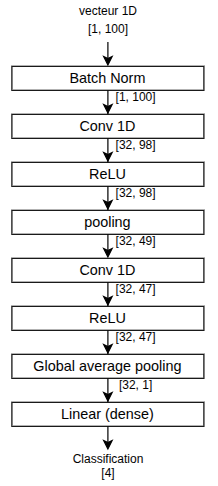
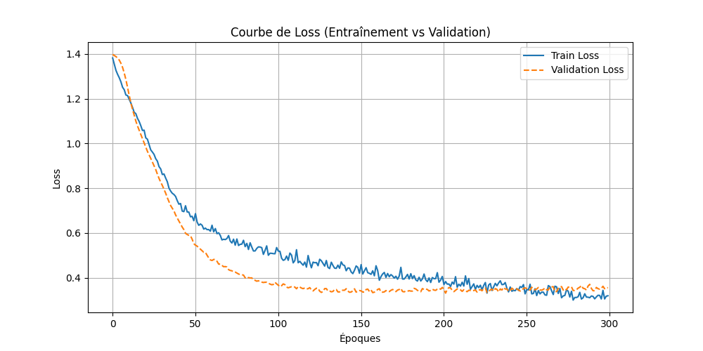
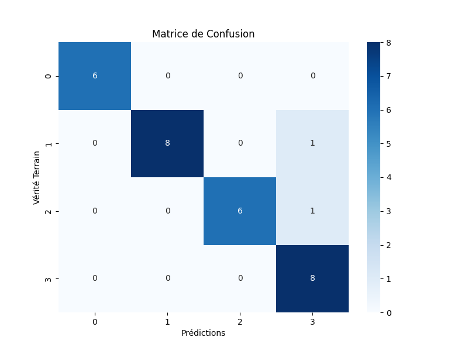

# QT-Touch 🤖🧤

[🇨🇵 Français](README_FR.md) | [🇬🇧 English](../README.md)

**Reconnaissance tactile par apprentissage automatique pour le robot QT.**

Ce projet permet de doter le robot QT d'un sens du toucher grâce à une veste équipée de capteurs piézo-résistifs. Le système utilise un modèle de Deep Learning pour classifier les interactions physiques, avec une inférence optimisée pour Raspberry Pi.

L'objectif final est d'intégrer ces retours tactiles au projet [QTRobot-Interaction](https://github.com/Juste-Leo2/QTRobot-Interaction) afin d'enrichir les interactions avec l'utilisateur.

---

## Présentation du projet

Bien que cette expérimentation ait été menée spécifiquement sur la partie droite du torse de la veste, la méthodologie et le modèle sont conçus pour être reproductibles sur l'ensemble des zones tactiles du robot.

### Méthodologie de traitement du signal
Pour garantir une détection précise, nous appliquons la chaîne de traitement suivante :
1. **Sur-échantillonnage** des données brutes du capteur.
2. **Filtrage numérique** : Application d'un système de moyenne mobile pour cadencer le signal à **100Hz**. Cela permet d'éliminer le bruit de fond et de stabiliser les entrées avant l'envoi au modèle.

---

## 🧠 Architecture & Entraînement

### Architecture du modèle
Le modèle a été conçu pour être léger et efficace pour une exécution en temps réel.

<p align="center">
  
</p>

### Détails de l'entraînement
*   **Dataset** : 150 exemples collectés, répartis équitablement entre les classes.
*   **Split** : 80% pour l'entraînement, 20% pour le test.
*   **Optimisation** : L'entraînement s'est déroulé sur **300 époques** avec une surveillance étroite des courbes pour éviter tout sur-apprentissage (overfitting).

<p align="center">
  
</p>

---

## 📊 Résultats et Performances

Le modèle atteint une **précision globale de 93,3 %** sur les données de test.

### Matrice de Confusion
Nous classifions les interactions selon 4 catégories distinctes :
*   **0 : Rien** (Absence de contact)
*   **1 : Tape** (Impact bref)
*   **2 : Pincement** (Pression localisée et maintenue)
*   **3 : Frottement** (Mouvement latéral)

<p align="center">
  
</p>

---

## 🛠️ Installation et Utilisation

### Gestionnaire de dépendances
Ce projet utilise [**uv**](https://astral.sh/uv), un gestionnaire de paquets Python extrêmement rapide.

**Installation de `uv` :**
*   **Linux / macOS** :
    ```bash
    curl -LsSf https://astral.sh/uv/install.sh | sh
    source $HOME/.cargo/env
    ```
*   **Windows (PowerShell)** :
    ```powershell
    powershell -ExecutionPolicy ByPass -c "irm https://astral.sh/uv/install.ps1 | iex"
    ```

### Préparation de l'environnement
```bash
# Clonage du dépôt
git clone https://github.com/Juste-Leo2/QT-Touch.git
cd QT-Touch

# Création de l'environnement virtuel et installation
uv venv -p 3.11
source .venv/bin/activate  # Sur Windows: .venv\Scripts\activate
uv pip install -r requirements.txt
```

### Exécution
*   **Pour lancer l'entraînement** :
    ```bash
    uv run train.py
    ```
*   **Pour l'inférence sur Raspberry Pi** :
    Consultez le [Guide d'inférence spécifique](../raspberry_inference/README_FR.md).
*   **Pour l'acquisition de données** :
    Utilisez le script `capture_data.py` (voir la documentation d'inférence pour le setup matériel).

---

## 📜 Informations complémentaires

*   **Inférence** : Le code optimisé pour Raspberry Pi est disponible dans le dossier `raspberry_inference/`.
*   **Licence** : Ce projet est sous licence **Apache 2.0**.
