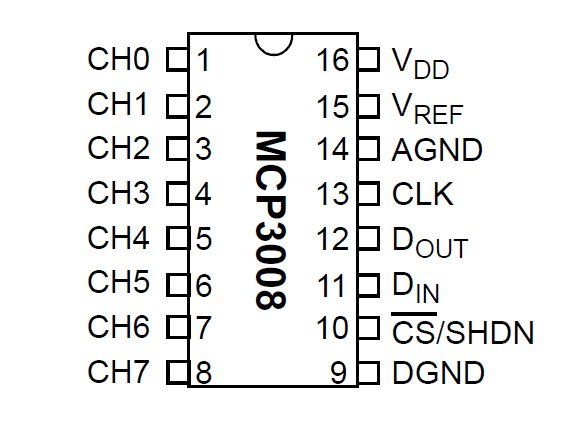
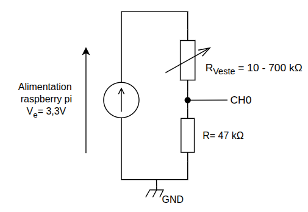

# 🍓 Guide d'Inférence sur Raspberry Pi

Ce guide détaille les étapes nécessaires pour configurer le matériel et l'environnement logiciel afin d'exécuter l'inférence du modèle sur Raspberry Pi.

---

## 🛠 Matériel (Hardware)

### 1. Branchement du MCP3008
Le MCP3008 est utilisé pour la conversion analogique-numérique (notamment pour le capteur du torse droit). 



**Schéma de câblage :**

Assurez-vous que l'alimentation et les broches de données sont correctement connectées aux GPIO du Raspberry Pi :

| Broche MCP3008 | Broche Raspberry Pi | Fonction |
| :--- | :--- | :--- |
| **VDD** | Pin 1 ou 17 (3.3V) | Alimentation positive |
| **VREF** | Pin 1 ou 17 (3.3V) | Tension de référence |
| **AGND** | Pin 6, 9... (GND) | Masse analogique |
| **DGND** | Pin 6, 9... (GND) | Masse numérique |
| **CLK** | GPIO 12 | Horloge |
| **DOUT** | GPIO 16 | MISO (Master In Slave Out) |
| **DIN** | GPIO 20 | MOSI (Master Out Slave In) |
| **CS/SHDN** | GPIO 21 | Chip Select |

### 2. Montage de la veste
Pour le branchement des capteurs de la veste, une résistance de **47 kΩ** est requise pour assurer la stabilité des mesures.



---

## 💻 Logiciel (Software)

### 1. Prérequis
* Un Raspberry Pi avec un système d'exploitation installé (Raspberry Pi OS recommandé).
* Une connexion internet active.

### 2. Mise à jour du système
Commencez par mettre à jour votre système et installez les bibliothèques nécessaires à la gestion des ports GPIO :

```bash
sudo apt update && sudo apt full-upgrade -y
sudo apt install python3-gpiozero python3-lgpio -y
```

### 3. Installation du gestionnaire de paquets `uv`
Nous utilisons **uv**, un gestionnaire de dépendances Python extrêmement rapide, pour gérer notre environnement virtuel.

```bash
# Installation de uv
curl -LsSf https://astral.sh/uv/install.sh | sh

# (Optionnel) Redémarrez votre terminal ou sourcez votre profil pour activer 'uv' dans le PATH
source $HOME/.cargo/env
```

### 4. Clonage et Préparation du Projet
Le modèle d'inférence est déjà inclus dans le dépôt.

```bash
# Récupération du projet
git clone https://github.com/Juste-Leo2/QT-Touch.git
cd QT-Touch/raspberry_inference

# Création de l'environnement virtuel avec Python 3.11
uv venv -p 3.11
source .venv/bin/activate

# Installation des dépendances
uv pip install -r requirements_rpi.txt
```

### 5. Exécution de l'inférence
Une fois l'environnement prêt, lancez le script d'inférence :

```bash
uv run inference.py
```

---
*Note : Assurez-vous que l'interface SPI est activée sur votre Raspberry Pi via `sudo raspi-config` (Interface Options > SPI).*
